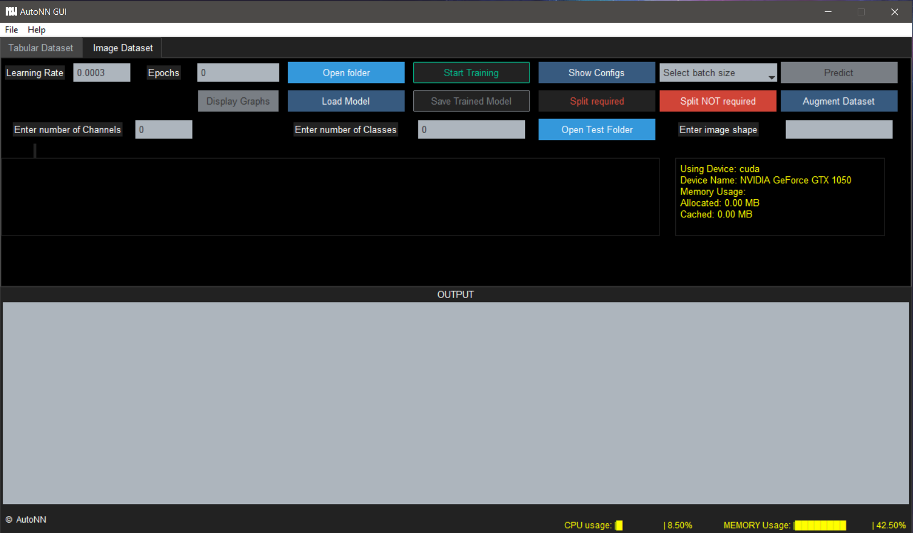

<p align="center">
 <a href="https://pypi.org/project/nocode-autonn/"> 
</p></a>

***
# AutoNN : An AutoML/ No Code ML Framework For Deep Learning enthusiast.

## Official <a href="https://autonn.github.io/AutoNN/">Website</a>

## Installation

Install it using pip package manager:
```python
pip install nocode-autonn
```

Upgrade the package using the following command:
```python
pip install --upgrade nocode-autonn
```

## Install all the dependencies 

```
pip install -r requirements.txt
```
## How to run the file:

Open terminal and write the following command:
```
autonn
```
# GUI Interface



