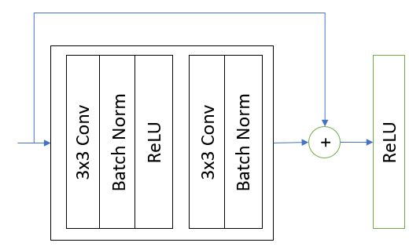

# AutoNN.CNN.cnnBlocks


## cnnBlocks.SkipLayer

This is basically a residual block, which is the core component of AutoNN's CNN architecture. Bunch of residual blocks are stacked together along with Pooling layers to give the full CNN architecture. 

  


### Source Code 

```python

class SkipLayer(nn.Module):
    def __init__(self,in_channels,featureMaps1,featureMaps2,
        kernel=(3,3),stride=(1,1),padding=1):
        super(SkipLayer,self).__init__()

        self.skiplayers=nn.Sequential(
            nn.Conv2d(in_channels,featureMaps1,kernel,stride,padding=padding),
            nn.BatchNorm2d(featureMaps1),
            nn.ReLU(),

            nn.Conv2d(featureMaps1,featureMaps2,kernel,stride,padding=padding),
            nn.BatchNorm2d(featureMaps2)
            )
        self.skip_connection = nn.Conv2d(in_channels,featureMaps2,kernel_size=(1,1),
                                        stride=stride)
        self.relu=nn.ReLU()

    def forward(self,x):
        x0 = x.clone()
        x = self.skiplayers(x)
        x0 = self.skip_connection(x0)
        x+=x0
        return self.relu(x)
```

## cnnBlocks.Pooling

Pooling layers consists of both `MaxPool` and `AvgPool`, which can be selected at the time of creating an instance of the Pooling class by providing the `pool_type`.

### Source Code

```python
class Pooling(nn.Module):
    def __init__(self,pool_type='maxpool'):
        super(Pooling,self).__init__()

        """
        Args:
            pool_type: 'maxpool' | nn.MaxPool2d
                       'avgpool' | nn.AvgPool2d
        """
        if pool_type.lower() =='maxpool':
            self.pool = nn.MaxPool2d(kernel_size=(2,2),stride=(2,2))
        else:
            self.pool = nn.AvgPool2d(kernel_size=(2,2),stride=(2,2))
    
    def forward(self,x):
        return self.pool(x)
```